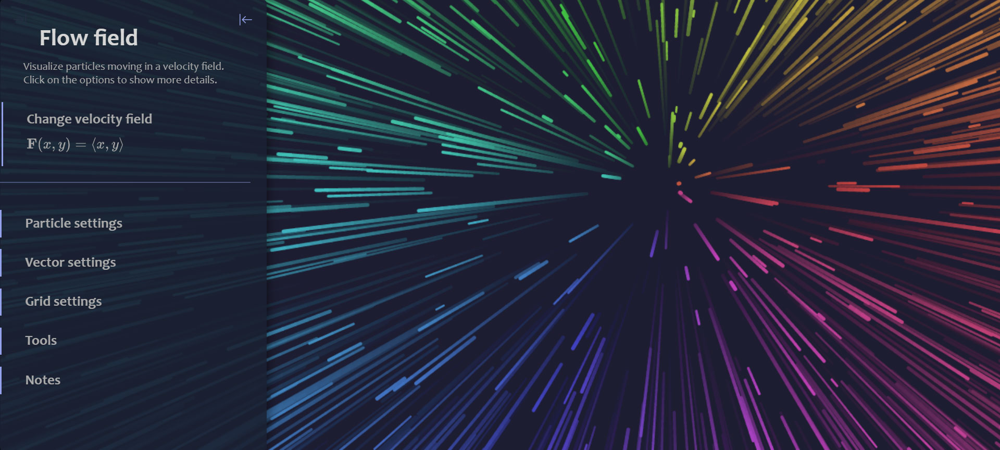
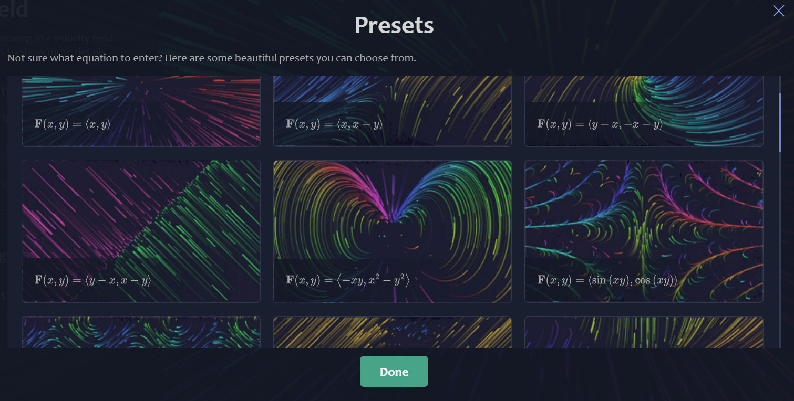
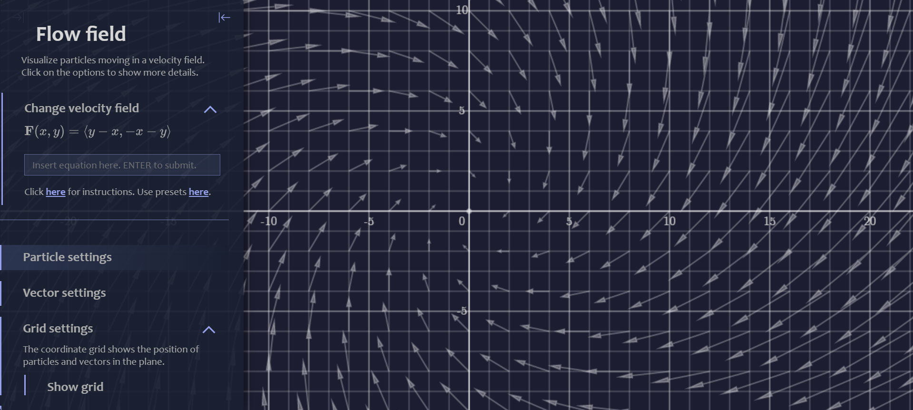

# Flow Field
A tool that animates vector fields.

## Table of contents
* [Demo](#demo)
* [General info](#general-info)
* [How to use](#how-to-use)
* [Notes](#notes)

## Demo
You can run the program by clicking <a href="https://chaselean.github.io/flow-field/">here</a>.

## General info
This program animates particles in a velocity field. You can change the vector field by entering your own equation, or choose from 25 presets. Click and drag to pan, and use the mouse wheel to zoom in and out.

## How to use
Customize the vector field with the menu on the left. 

### Particle settings
Drag the sliders to change the number of particles, the size of the particles and choose to give them a uniform color, color by angle or color by velocity.

### Vector settings
Display the vectors that make up the vector field as arrows, and customize their density and length.

### Grid settings
Display the coordinate grid to visualize the vector field in the 2-D plane.

## Notes
Vector fields are beautiful. This program aims to make them accessible in a fun and interactive way. There are still a few limitations:
* Mobile is not supported.
* Drawing a large number of particles causes lag.
* The animation fails at points where the vector field becomes unbounded.

They will hopefully be adressed in a future update.
